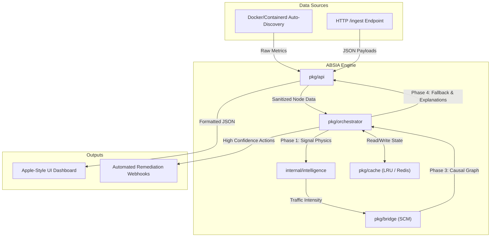

# ABSIA Architecture Blueprint

This document maps out the internal architecture, dependencies, and data flow of the ABSIA Causal Inference Engine.

---

## High-Level Architecture

ABSIA is written in pure Go to achieve maximum performance and memory safety. It compiles to a single static binary with no external dependencies.



---

## Directory Structure

ABSIA follows standard Go project layout conventions.

```text
absia/
├── cmd/
│   └── absia/
│       └── main.go              # Application entrypoint
├── pkg/
│   ├── api/                     # HTTP Handlers and Embedded UI
│   │   ├── handlers.go          # Routes: /health, /nodes, /analyze
│   │   └── ui/                  # Vanilla HTML/CSS/JS frontend
│   ├── bridge/                  # Structural Causal Models (SCM)
│   ├── cache/                   # Pluggable LRU / Redis storage
│   ├── orchestrator/            # The brain: connects all phases together
│   ├── autodetect/              # Runtime discovery (Docker, CRI-O)
│   └── telemetry/               # Internal profiling (expvar)
├── internal/
│   └── intelligence/            # Deep math (Queueing theory, Pattern detection)
├── Dockerfile                   # Multi-stage scratch build
└── README.md                    # Project overview
```

---

## The 5-Phase Intelligence Pipeline

When an `/analyze` request is triggered, the `pkg/orchestrator` runs the data through a strict, deterministic 5-phase pipeline.

### Phase 1: Signal Physics (`internal/intelligence/phase1_signal`)
Calculates raw queueing physics. 
- Analyzes `arrival_rate` (λ) and `service_rate` (μ).
- Determines Traffic Intensity (`rho = λ / μ`).

### Phase 2: Pattern Detection (`internal/intelligence/phase2_pattern`)
Analyzes historical bounds.
- Checks if the current `rho` violates historical norms.
- Assigns a base temporal confidence score.

### Phase 3: Causal Graph Generation (`pkg/bridge`)
The core ML engine.
- Instantiates Structural Causal Models (Linear, Polynomial, Logistic).
- Runs `RunIntervention()` to simulate "what if" scenarios mathematically without touching production.

### Phase 4: Fallback & Semantics (`pkg/orchestrator`)
The safety net.
- Calculates final `ConfidenceScore`.
- If confidence is low, drops the complex causal data and returns a safe fallback response.

### Phase 5: Narrative Generation (`pkg/api/handlers.go`)
Translation layer.
- Takes the math outputs and translates them into plain-English arrays (e.g., `"The node test-service is overloaded."`) for the UI to digest.
